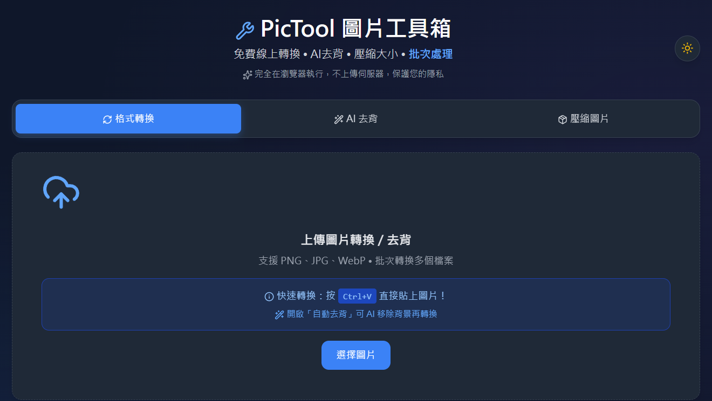

# 🛠️ PicTool 圖片工具箱｜免費線上圖片轉換・AI去背・壓縮

**PicTool** 是一款輕量級、免安裝的線上圖片工具箱，直接在瀏覽器中執行，無需上傳伺服器。提供三大核心功能：**圖片格式轉換**、**AI 自動去背**、**圖片壓縮到指定大小**。

👉 **[立即使用 PicTool](https://sid-1996.github.io/pictool/)**

---

## ✨ 功能一覽

### 🔄 格式轉換
- PNG、JPG、WebP 格式互轉
- **ICO 圖示生成** — 一鍵轉換為 favicon 或桌面應用圖示
- 批次處理多個檔案
- 自訂輸出尺寸（16×16 ~ 256×256）
- 多種縮放模式（等比、裁切、拉伸、置中）
- 自訂背景色（透明、白色、自訂顏色）

### 🎨 AI 自動去背
- 使用瀏覽器端 AI 模型（[@imgly/background-removal](https://github.com/imgly/background-removal.js)）
- **圖片不上傳伺服器**，保護隱私
- 去背後可套用背景設定（透明/白色/自訂色）
- 預覽去背結果（西洋棋盤格透明背景提示）
- 支援各種圖片格式

### 📦 圖片壓縮
- 自訂目標檔案大小（KB / MB）
- **二分搜尋演算法** — 自動尋找最佳壓縮品質
- 支援 JPEG、WebP、PNG 輸出
- 可選最大寬高限制（先縮圖再壓縮）
- 保留透明度（WebP / PNG）
- 壓縮前後對比預覽

### 🎨 介面特色
- 深色模式支援 🌙
- 拖曳上傳 + 剪貼簿貼上 (`Ctrl+V`)
- 完全響應式設計（手機/平板/桌面）
- 純前端架構，無需註冊或安裝

---

## 🚀 使用方式

1. 開啟 [PicTool 網頁版](https://sid-1996.github.io/pictool/)
2. 拖曳圖片或點擊上傳，也可按 `Ctrl+V` 貼上
3. 選擇功能模式：
   - **格式轉換** — 設定輸出格式、尺寸、背景色後轉換
   - **壓縮圖片** — 設定目標大小（KB/MB），自動尋找最佳品質
   - **AI 去背** — 切換到去背分頁，一鍵移除背景並下載
4. 預覽結果並下載

---

## 🖼️ 支援格式

| 功能 | 輸入格式 | 輸出格式 |
|------|---------|---------|
| 格式轉換 | PNG, JPG, WebP, BMP, GIF, TIFF | **ICO**, PNG, WebP |
| AI 去背 | PNG, JPG, WebP | 透明 PNG |
| 圖片壓縮 | PNG, JPG, WebP | **JPEG**, WebP, PNG |

---

## 🔧 技術架構

- **純前端** — HTML + CSS + Tailwind CSS (CDN) + Vanilla JavaScript
- **無後端** — 所有運算在瀏覽器執行，圖片不上傳
- **Canvas API** — 圖片縮放、格式轉換
- **@imgly/background-removal** — 瀏覽器端 AI 去背（WebAssembly + TensorFlow.js）
- **二分搜尋** — 壓縮品質自動優化
- **GitHub Pages** — 靜態託管

---

## 📸 螢幕截圖

---

## 📜 授權

本專案採用 [MIT License](https://opensource.org/licenses/MIT) — 歡迎自由使用、修改與分發。

---

## ☕ 支持作者

如果 PicTool 對你有幫助，歡迎用你喜歡的方式支持我。

---

# 🛠️ PicTool - Free Online Image Toolkit

A lightweight, browser-based image toolkit with **format conversion**, **AI background removal**, and **image compression**. No installation, no server upload — everything runs in your browser.

👉 **[Try PicTool Now](https://sid-1996.github.io/pictool/)**

## Features

- **Format Conversion** — PNG/JPG/WebP interconversion, ICO icon generation, batch processing, custom output size (16×16 ~ 256×256)
- **AI Background Removal** — Browser-side AI model via [@imgly/background-removal](https://github.com/imgly/background-removal.js), no server upload
- **Image Compression** — Target file size (KB/MB) with binary search optimization for best quality
- **Privacy First** — All processing happens locally in your browser; no images are uploaded

## How to Use

1. Open [PicTool](https://sid-1996.github.io/pictool/)
2. Drag & drop images, click to upload, or press `Ctrl+V` to paste
3. Choose a mode:
   - **Convert** — Set output format, size, and background color
   - **Compress** — Set target size (KB/MB), auto-finds optimal quality
   - **Remove Background** — Switch to the deback tab, one-click background removal
4. Preview results and download

## Supported Formats

| Feature | Input | Output |
|---------|-------|--------|
| Format Conversion | PNG, JPG, WebP, BMP, GIF, TIFF | **ICO**, PNG, WebP |
| AI Background Removal | PNG, JPG, WebP | Transparent PNG |
| Image Compression | PNG, JPG, WebP | **JPEG**, WebP, PNG |

## Tech Stack

- **Pure Frontend** — HTML + CSS + Tailwind CSS (CDN) + Vanilla JavaScript
- **No Backend** — All processing runs in the browser, no image uploads
- **Canvas API** — Image scaling, format conversion
- **@imgly/background-removal** — Browser-side AI background removal (WebAssembly + TensorFlow.js)
- **Binary Search** — Automatic compression quality optimization
- **GitHub Pages** — Static hosting

## License

MIT

## Support

If this tool helps you, feel free to support me:

